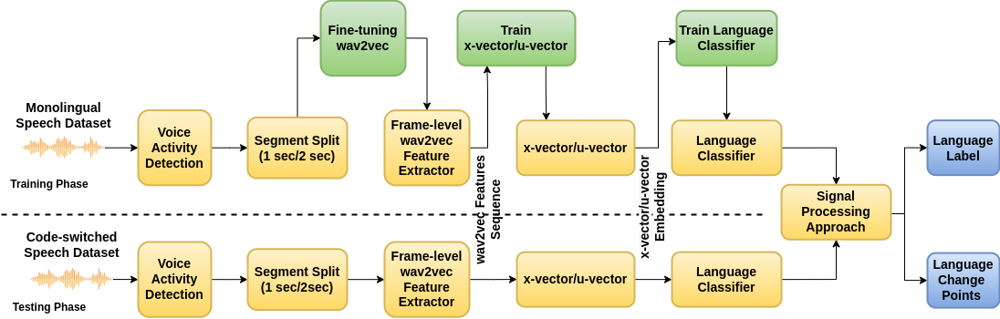

# Spoken Language Diarisation for Indian Native Languages Codemixed with English



## Overview

This repository contains the codebase for my bachelor's Major Technical Project 2023-24. The project aims to develop a spoken language diarisation system for Indian native languages codemixed with English.

## Problem Statement

The problem addressed in this project is the lack of robust language diarisation systems for Indian native languages, especially when they are codemixed with English. Existing diarisation systems often struggle to accurately identify and distinguish between different languages spoken within the same conversation, leading to poor performance in multilingual environments.

## Objectives

- Develop a language diarisation system capable of accurately identifying and segmenting speech in Indian native languages codemixed with English.
- Investigate the effectiveness of different feature extraction and modelling techniques, including Wave2Vec2, X-Vector, and U-Vector, for language diarisation in multilingual contexts.
- Implement the system using efficient parallel processing techniques to handle large-scale datasets and real-time applications.

## Conclusion

Through extensive experimentation and evaluation, the developed language diarisation system demonstrates promising results in accurately identifying and segmenting speech in Indian native languages codemixed with English. The use of advanced deep learning models such as Wave2Vec2, coupled with parallel processing techniques, has significantly improved the performance of the system compared to traditional approaches.

## Future Work

- Further optimize the system for real-time performance and scalability, particularly for handling larger datasets and streaming data.
- Explore additional feature extraction and modelling techniques to enhance the robustness and adaptability of the system to diverse linguistic contexts.
- Extend the system to support a wider range of Indian native languages and dialects, considering the linguistic diversity present in the region.

## Table of Contents

- [Overview](#overview)
- [Problem Statement](#problem-statement)
- [Objectives](#objectives)
- [Conclusion](#conclusion)
- [Future Work](#future-work)
- [Installation](#installation)
- [Usage](#usage)
- [Files Description](#files-description)
- [Final Report](#final-report)
- [Contributing](#contributing)
- [License](#license)

## Installation

1. Clone the repository:

   ```bash
   git clone https://github.com/yourusername/your-repository.git
   ```

2. Install the required dependencies:

   ```bash
   pip install -r requirements.txt
   ```

## Usage

To use this codebase, follow the steps below:

1. **Training Wave2Vec2 Model:**

   For fine-tuning the Wave2Vec2 model, execute:

   ```bash
   python src/wav2vec2/main_v1_1.py
   ```

2. **Hidden Feature Extraction:**

   To extract hidden features from the Wave2Vec2 model, run:

   ```bash
   python src/tdnn/fasterHiddenFeatures-ddp.py
   ```

3. **X-Vector and U-Vector Training:**

   Train X-Vector and U-Vector models using the extracted hidden features:

   ```bash
   python src/tdnn/xVectorTraining-ddp.py
   ```

   ```bash
   python src/uVector/uVectorTraining-ddp.py
   ```

4. **Language Diarization:**

   Evaluate language diarization using either X-Vector or U-Vector approach:

   ```bash
   python src/evaluate/languageDiarizer-fast-uvector.py
   ```

   ```bash
   python src/evaluate/languageDiarizer-fast-xvector.py
   ```

   These scripts will generate the final RTTM files. Make sure to update hardcoded paths and variables in all above files as per your requirements.

## Files Description

- `src/common/datasetPrebuild.py`: Generates prebuilt datasets in the required Hugging Face format.
- `src/wav2vec2/main_v1_1.py`: Fine-tunes the Wave2Vec2 model.
- `src/tdnn/fasterHiddenFeatures-ddp.py`: Extracts hidden features from the Wave2Vec2 model.
- `src/tdnn/xVectorTraining-ddp.py`: Trains X-Vector model using extracted hidden features.
- `src/uVector/uVectorTraining-ddp.py`: Trains U-Vector model using extracted hidden features.
- `src/evaluate/languageDiarizer-fast-uvector.py`: Evaluates language diarization using U-Vector approach.
- `src/evaluate/languageDiarizer-fast-xvector.py`: Evaluates language diarization using X-Vector approach.
- `scripts/`: Contains scripts for running the codebase on HPC. Make appropriate changes if not on Param-Siddhi HPC tailored to your HPC specs.

## Final Report

For detailed information about the project, refer to the [Final Report](MTP2_Report.pdf).
